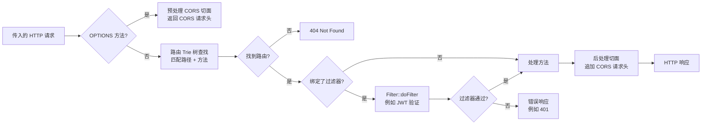
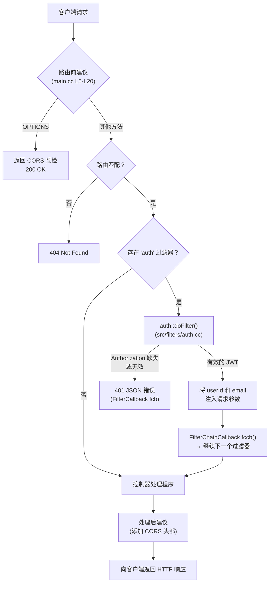
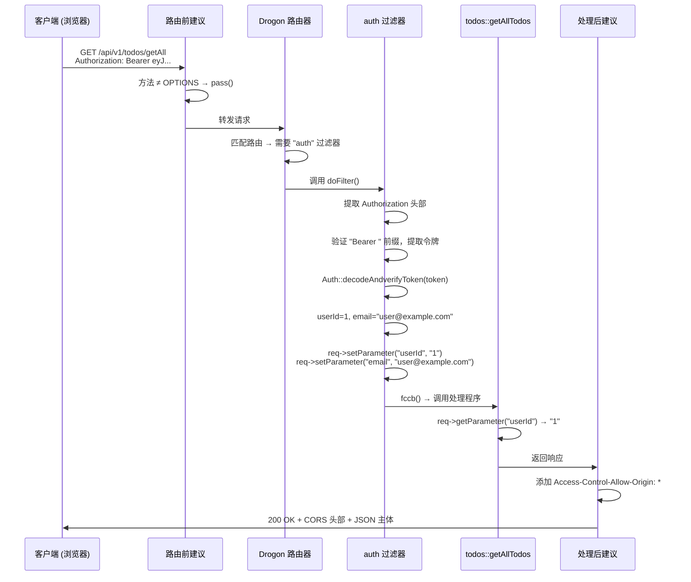
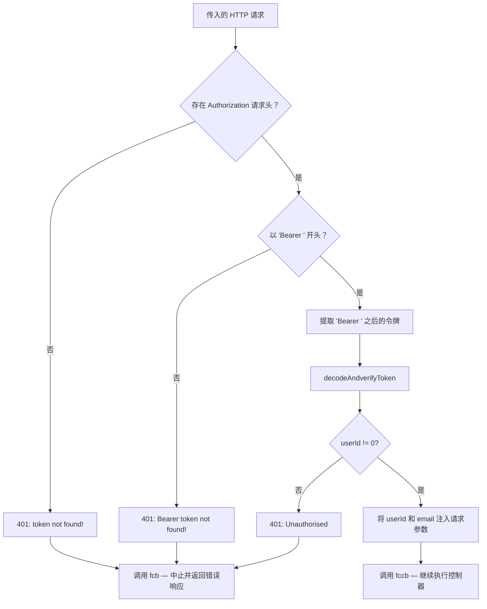
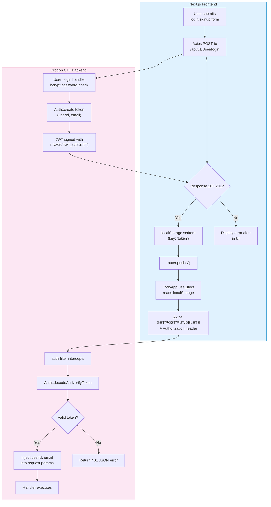
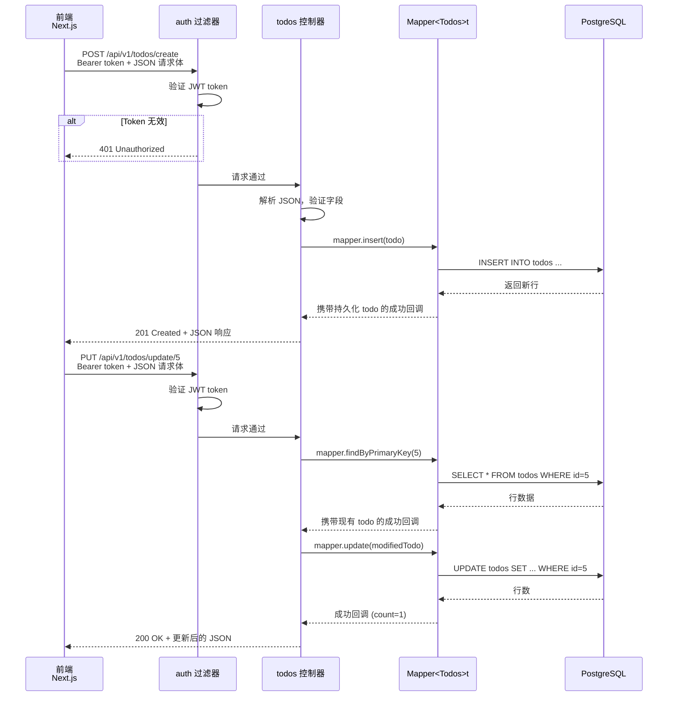

# my_fastest_drogon_app_cpp
> [中文详细参考文档](https://zread.ai/suryanshvermaa/my-fastest-drogon-app-cpp/)

1. 修改docker-compose.yml
    指定卷目录
    ```yml
    - /drogon_dev/my-fastest-drogon-app-cpp/init.sql:/docker-entrypoint-initdb.d/init.sql:ro
    - /data/usershare/PG/pgdata:/var/lib/postgresql/data
    ```
2. 启动数据库
    ```bash
    sudo docker-compose -f /drogon_dev/my-fastest-drogon-app-cpp/docker-compose.yml up -d postgres
    ```

3. 启动开发环境
    ```bash
   sudo docker run -it \
    -p 8010:22 \
    -p 3100:3100 \
    -p 8100:8100 \
    -p 8083:8083 \
    -p 3001:3001 \
    -e JWT_SECRET=mysecretkey \
    -v /drogon_dev/:/install/drogon_dev \
    --name dx_drogon_dev \
    -v /etc/localtime:/etc/localtime:ro \
    -d dx_drogon_dev:1.0
    ```
   
4. 忘记加入子网，再加入子网
    ```bash
   sudo docker network create my-net
   sudo docker network connect my-net dx_drogon_dev
   sudo docker network connect my-net postgres_prod
   sudo docker network inspect my-net
    ```
   或者只修改开发容器的网络配置
    ```bash
   sudo docker network create my-fastest-drogon-app-cpp_default
   sudo docker network connect my-fastest-drogon-app-cpp_default dx_drogon_dev
   ```
   > **为什么需要网络标志？** 烘焙到镜像中的 config.docker.json 告诉 Drogon 连接到 host: "postgres"。
   > 要让这个 DNS 名称成功解析，API 容器必须与 PostgreSQL 容器处于同一个 Docker Compose 网络中。
   > Compose 会将网络命名为 <项目目录名>_default。
  
5. 进入开发环境
    ```bash
   sudo docker start dx_drogon_dev && sudo docker exec -it dx_drogon_dev bash
    ```
   
6. 使用CLion调试后端时，需要添加环境变量`JWT_SECRET=mysecretkey`
   针对my_drogon_app->编辑配置->环境变量->添加JWT_SECRET=mysecretkey->确定
  
7. 编译启动应用报错，提示数据库连接失败 ，修改config.json
   指定数据库连接信息`postgres_prod`
    ```json
    {
        "db_clients": [
            {
                "rdbms": "postgresql",
                "host": "postgres_prod",
                "port": 5432,
                "dbname": "userdb",
                "user": "postgres",
                "password": "postgres",
                "charset": "utf8mb4"
            }
        ]
    }
    ```
   - 再次编译启动应用，成功连接数据库
   - 健康检测
    ```bash
    http://192.168.250.101:3001/api/v1/health/
    ```
   输出
    ```json
    {"message":"healthy","success":true}
    ```
 - 如果不使用CLion调试 
   - 配置并构建应用：
   ```bash
   mkdir -p build && cd build
   cmake .. -DCMAKE_BUILD_TYPE=Debug
   cmake --build . -j
   ```
   
   - 设置 JWT 密钥并运行：
   ```bash
   export JWT_SECRET="your-secret-key"
   ./my_drogon_app
   ```

8. 宿主机安装安装 Node.js 和 npm 
    ```bash
    sudo apt install -y nodejs npm
    # 验证安装
    node -v
    npm -v
    ```
9. 添加环境变量 NEXT_PUBLIC_BACKEND_URL
   前端项目根目录的 .env.local 文件中正确配置了环境变量：
   
   ```bash
   NEXT_PUBLIC_BACKEND_URL=http://192.168.250.101:3001
   ```
   > 注意：localhost / 127.0.0.1 在开发环境中都指向宿主机，使用NET网络不能访问到虚拟机中的服务
   > 改为 `http://192.168.250.101:3001`
   

10. 启动前端
    ```bash
    cd /drogon_dev/my-fastest-drogon-app-cpp/frontend
    npm install
    npm run dev
    ```
    
    - `npm install` 报错ERR! code EACCES
        ```bash
        # 更改目录所有权
        sudo chown -R $(whoami):$(whoami) /drogon_dev/my-fastest-drogon-app-cpp
        
        # 进入项目目录（不要用 sudo！）
        cd /drogon_dev/my-fastest-drogon-app-cpp/frontend

        # 删除旧依赖（可能已损坏）
        rm -rf node_modules package-lock.json
    
        # 安装 nvm
        curl -o- https://raw.githubusercontent.com/nvm-sh/nvm/v0.39.7/install.sh | bash
        
        # 重新加载终端
        source ~/.bashrc  # 或 source ~/.zshrc
        
        # 安装 Node.js
        nvm install --lts
        
        # 验证安装
        node -v && npm -v
    ```
    
    - 再次执行`npm install`，成功
    - 执行`npm run dev`，成功`

11. 访问前端
    ```bash
    http://192.168.250.101:3000
    ```

## 项目文件概览

    my-fastest-drogon-app-cpp/
    ├── docker-compose.yml          ← 编排所有服务
    ├── Dockerfile                  ← 生产环境：多阶段构建
    ├── Dockerfile.dev              ← 开发环境：包含工具的单阶段构建
    ├── db.dockerfile               ← 轻量级 PostgreSQL + init.sql
    ├── config.docker.json          ← 用于容器网络的后端配置
    ├── config.json                 ← 用于本地开发的后端配置
    ├── init.sql                    ← 数据库模式（users + todos 表）
    ├── dependencies.sh             ← 获取 jwt-cpp + Bcrypt.cpp
    ├── CMakeLists.txt              ← C++ 构建配置
    └── scripts/
    └── dev-entrypoint.sh       ← 开发容器启动脚本

## 后端架构：Drogon C++ 框架
   ```
   src/
   ├── main.cc                    ├── controllers/
   │   ├── api_v1_User.h/.cc      # 认证端点：注册、登录、个人信息
   │   ├── api_v1_todos.h/.cc     # Todo 的 CRUD 端点（6 个操作）
   │   └── api_v1_health.h/.cc    # 存活探针端点
   ├── filters/
   │   ├── auth.h/.cc             # JWT Bearer 令牌验证过滤器
   │   └── CorsMiddleware.h/.cc   # 附加的 CORS 工具
   ├── models/
   │   ├── Users.h/.cc            # `users` 表的 ORM 模型（自动生成）
   │   ├── Todos.h/.cc            # `todos` 表的 ORM 模型（自动生成）
   │   └── model.json             # ORM 生成配置（数据库连接 + 表）
   └── utils/
   ├── token.h/.cc            # JWT 创建（HS256）和验证工具
   └── AppError.h/.cc         # 附带 HTTP 状态码的自定义异常
   ```
   
## 前端架构：Next.js 15
   ```
   frontend/
   ├── app/
   │   ├── auth/               # 认证页面（登录/注册）
   │   ├── page.tsx            # 根页面 → TodoApp 组件
   │   ├── layout.tsx          # 包含 Geist 字体的根布局
   │   └── loading.tsx         # 加载状态 UI
   ├── components/
   │   ├── TodoApp.tsx         # 核心编排组件（状态 + API 调用）
   │   ├── LoginPage.tsx       # 登录表单 → POST /api/v1/User/login
   │   ├── SignUpPage.tsx      # 注册表单 → POST /api/v1/User/signup
   │   ├── Header.tsx          # 带有统计数据的导航头部
   │   ├── ProgressCard.tsx    # Todo 完成进度
   │   ├── AddTodoForm.tsx     # 创建新 Todo 的表单
   │   ├── TodoFilters.tsx     # 按状态过滤 + 搜索
   │   ├── TodoList.tsx        # 渲染过滤后的 Todo 项
   │   ├── TodoItem.tsx        # 带有切换/删除功能的单个 Todo
   │   └── ui/                 # 可复用的 UI 基础组件（Button、Card 等）
   ├── types/
   │   └── todo.ts             # Todo 接口 + FilterType 联合类型
   └── .env.local              # 环境变量配置文件(需要手动添加)，后端 URL 来源于 NEXT_PUBLIC_BACKEND_URL 环境变量
   ```
## CORS 处理 —— 双层防御
   >跨源资源共享（CORS）必不可少，因为 Next.js 前端运行在与 Drogon 后端（端口 3001）不同的端口（通常是 3000）上。
   >该应用程序在两个不同的层级实现了 CORS，理解其原因对于任何修改此代码的人都非常重要。 

   - 第一层：预处理路
      >第一层在任何路由发生之前拦截每个传入请求。如果请求是 HTTP OPTIONS 方法（浏览器 CORS 预检请求），
     > 它会立即响应适当的 CORS 头，并通过调用 stop(resp) 停止进一步处理。
     > 非 OPTIONS 请求则通过 pass() 传递到正常的路由流水线。
   
      |Header|Value|Purpose|
      |---|---|---|
      |Access-Control-Allow-Origin|*	|允许来自任何源的请求|
      |Access-Control-Allow-Methods|*	|在预检中允许所有 HTTP 方法 |
      |Access-Control-Allow-Headers|*, Authorization	|允许所有请求头，显式包含用于 JWT 的 Authorization|
      |Access-Control-Max-Age|86400	|将预检结果缓存 24 小时|
   
     - 第二层：后置处理
      >第二层在任何控制器生成响应之后运行。它为所有传出的响应添加 Access-Control-Allow-Origin: * 头，
     > 确保即使是非预检请求（实际的 GET、POST 等）在其响应中也携带 CORS 头。 

### 为什么需要两个独立的处理器？
   这种分离遵循标准的 CORS 协议。浏览器首先发送预检 OPTIONS 请求以检查权限——预处理路由处理器负责响应。
   然后是实际请求，后置处理处理器确保响应本身与浏览器兼容。这种两阶段设计是 Web 标准，而非冗余。

### CorsMiddleware 过滤器（可用但冗余）
   > `src/filters/CorsMiddleware.cc` 中的 `CorsMiddleware` 类提供了第三种、基于过滤器的 CORS 实现。
   > 它目前没有通过 `METHOD_ADD` 宏接入任何控制器路由（与 `auth` 过滤器不同），因此它充当替代或备份实现。
   > 如果你需要针对单个路由的 CORS 控制而不是全局 CORS，这个过滤器就是可供使用的机制。

---

`CorsMiddleware.h` 和` CorsMiddleware.cc` 中的 `CorsMiddleware` 类实现了
与路由前建议相同的 OPTIONS 拦截逻辑，但是处于 HttpFilter 框架内。
然而，应用中当前没有任何路由引用此过滤器 —— 它没有绑定到任何 `METHOD_ADD` 或 `ADD_METHOD_TO` 调用。
`main.cc` 中的路由前建议取代了它，因为该建议在请求生命周期中运行得更早，并且已经全局处理了所有的 OPTIONS 请求。

>`CorsMiddlewar`e 过滤器作为一种替代模式存在，如果你需要针对特定路由的 CORS 策略
> （例如，对特定端点实施更严格的来源限制），它可能会派上用场。要激活它，
> 你需要在路由的 `METHOD_ADD` 或 `ADD_METHOD_TO`  宏中添加 "CorsMiddleware" 作为过滤器参数。
> 然而，对于统一的 CORS 策略，全局建议方法更为简单，这也是应用实际采用的方式。


### 应用层级的 CORS 处理
   虽然 CORS 配置本身不属于 `HttpController 机制的一部分，但它直接影响路由对于基于浏览器的客户端的行为表现。
   应用在 main.cc 中注册了两个切面——预处理和后处理——而不是将 CORS 委托给单个控制器或过滤器。

   ---
   **预处理切面**全局拦截每个 `OPTIONS` 请求，返回 CORS 请求头并调用 `stop() `以防止请求到达任何控制器。
   这处理了浏览器的预检机制。**后处理切面**在控制器完成处理后，为每个响应追加 `Access-Control-Allow-Origin: *`，
   确保实际的 `GET/POST/PUT/DELETE` 响应也符合 CORS 规范。

   ---
   这种分离意味着控制器完全不需要感知 CORS 问题——它们只接收实质性的 HTTP 方法，并且可以纯粹专注于业务逻辑。

---

## Dockerfile
   >在生产环境中，`Dockerfile` 使用多阶段构建：`builder` 阶段从源码编译 `Drogon` 并以 `Release` 模式构建应用程序，
   > 随后精简的 `runtime` 阶段仅复制二进制文件、共享库和配置文件 —— 从而生成显著更小的生产镜像。
   > 运行时以非 `root` 用户（`appuser`）运行，并在端口 `3001` 上包含健康检查。

## 请求生命周期总结
将所有部分结合起来，以下是在此 Drogon 应用中，请求从到达至响应所经历的完整路径：

---
下图展示了经过身份验证的端点（例如 GET /api/v1/todos/getAll）的完整请求生命周期：



---
## 请求处理流程：端到端示例
一个携带有效 JWT 对 GET /api/v1/todos/getAll 发起的典型经过身份验证的请求：


## 请求处理流程：过滤器执行顺序




## 从用户交互到后端验证的完整数据流，说明了 token 在何处被创建、存储、传输和验证



## 请求流程：完整生命周期
下图追踪了一个典型的“创建后更新”工作流，展示了在两个连续请求中，auth 过滤器、控制器处理函数、ORM mapper 和数据库之间是如何交互的：

